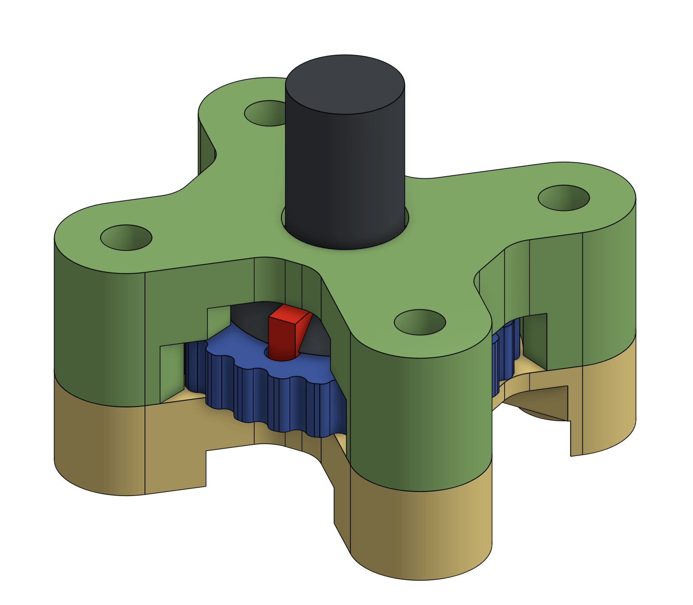

# Ez Crampon Caddy

## Why?

Depending on your printer, the stock design is hard to assemble to the nozzle with any level of rigidity. This design contains an integrated thumbwheel that allows the user to fasten into the nozzle while heeping the desired orientation.

## Parts / Assembly

* The 4 STL files, printed
* 4x M3x15 screws. Low profile best
* Crampon board
* The nozzle screw that comes with the Crampon board

It's intended for the top part to be tapped with M3 threads but probably screwing the M3 directly in will work fine. Not tested.

Warning: it's intended for all the parts to be a very close fit to stop them rattling around and affecting the results. In all likelihood on first assembly the thumbwheel will bind. Sand 0.05-0.1mm off then thumbwheel and the key until it's fairly free but not rattling.
